# GenQ

GenQ is an educational web application designed to digitize academic content and reduce the use of physical materials in learning processes.

The platform allows users to create, manage, and share quizzes while integrating artificial intelligence features to automatically generate questions. This solution simplifies assessment creation, reduces preparation time, and improves access to digital learning resources.

---

<div align="center">
  <div style="
    background-color: rgb(255,25,80);
    width: 210px;
    height: 210px;
    border-radius: 50%;
    display: flex;
    align-items: center;
    justify-content: center;
  ">
    
  </div>
</div>

</br>
<p align="center">
  <a href="https://albinjunliang.github.io/genq/" target="_blank">
    
  </a>
</p>

---

# Table of Contents

- [Key Features](#key-features)
- [Functional Requirements](#functional-requirements)
  - [General System Rules](#1-general-system-rules)
  - [User Roles & Permissions](#2-user-roles--permissions)
- [Quiz Generation Template](#quiz-generation-template)
- [Additional URLs](#additional-urls)
- [Tech Stack](#-tech-stack)
- [System Architecture](#system-architecture)
- [Backend Environment and Configuration](#backend-environment-and-configuration)
- [Frontend Environment and Configuration](#frontend-environment-and-configuration)
- [Docker Configuration](#docker-configuration)

---

# Key Features

- **Quiz interaction:** Users can play and complete quizzes.
- **Quiz creation:** Users can create their own quizzes and questions.
- **Quiz sharing:** Users can share quizzes through QR codes or dedicated links.
- **AI-powered quiz generation:** Users can use AI to automatically generate new quizzes.

---

# Functional Requirements

## 1. General System Rules

- **Rate Limiting:**  
  To optimize resource consumption, the system limits quiz generation to **10 prompts per hour** for standard sessions.

- **Multimodal Input:**  
  The system supports both keyboard text input and voice commands.

---

## 2. User Roles & Permissions

### A. Guest (Unregistered User)

- Subject to the standard rate limit of **10 prompts per hour**.
- No data persistence; sessions are lost when the browser is closed.

---

### B. Registered User

- **Quiz Management:**  
  Users can manually create, update, delete, and read quizzes.

- **Progress Score:**  
  Users can access stored feedback and quiz results.

- **Quiz Restart:**  
  Users can restart quizzes and attempt them again.

---

### C. Administrative User (Admin)

- **Unlimited Access:**  
  Administrators bypass the hourly rate limit.

- **System Oversight:**  
  Provides high-level access to application management.

---

# Quiz Generation Template

The AI quiz generator uses the following structure:

```txt
Eres un generador de quizzes experto. Salida: SOLO un objeto JSON puro, iniciando con '{' y terminando con '}'. Sin explicaciones, saludos ni markdown.

Idioma: ${lang}

ESTRUCTURA:

1. title (string, máximo 255 caracteres)
2. description (string, máximo 600 caracteres)
3. visibility (enum: PUBLIC | PRIVATE | ACCESS_ONLY_VIA_LINK | INACTIVE)
4. attemptsLimit (number, entero positivo)
5. questions (array, mínimo 1, máximo 10):

   - content (string, máximo 600 caracteres)
   - type (enum: UNIQUE | MULTIPLE | OTHER)
   - feedback (string, máximo 600 caracteres, obligatorio)

   - answers (array):
      - content (string, máximo 600 caracteres)
      - isCorrect (boolean)

REGLAS:

type debe coincidir con la lógica de answers:

UNIQUE:
Solo una respuesta correcta.

MULTIPLE:
Una o más respuestas correctas.

FORMATO:

{
  "title": "Título del Quiz",
  "description": "Descripción breve",
  "visibility": "PUBLIC",
  "attemptsLimit": 3,
  "questions": [
    {
      "content": "¿Pregunta?",
      "type": "UNIQUE",
      "feedback": "Explicación de la respuesta",
      "answers": [
        {
          "content": "Respuesta A",
          "isCorrect": true
        },
        {
          "content": "Respuesta B",
          "isCorrect": false
        }
      ]
    }
  ]
}
```

---

# Additional URLs

## Example of a Shared Quiz URL

```text
https://albinjunliang.github.io/genq/quiz/5665565632655
```

---

# 🛠 Tech Stack

| Layer | Technology |
|---|---|
| Frontend | Angular |
| Backend | Node.js, Express.js |
| Database | MySQL |
| AI Integration | OpenRouter, Groq, Cerebras APIs |

---

# System Architecture

<p align="center">
  
</p>

---

# Backend Environment and Configuration

## Environment Variables

`.env`

```yaml
DB_NAME=genq
DB_USER=root
DB_PASS=123456

MYSQL_ADDON_PORT=3306
LOCAL_ADDON_URI=mysql://
MYSQL_ADDON_URI=mysql://

ENVIRONMENT=development

FIREBASE_SERVICE_ACCOUNT={"type": ""}

OPENROUTER_API_KEY=
GROQ_API_KEY=
CEREBRAS_API_KEY=

ADMIN_EMAILS=admin@gmail.com
```

---

## Dependency Installation

```shell
npm install
```

---

## Run Scripts

```shell
npm run dev   # Development

npm start     # Production
```

---

# Frontend Environment and Configuration

## environment.ts

```ts
export const environment = {
    production: true,
    mockeable: false,
    apiUrl: 'https://localhost:5050/api/v1',
    firebaseConfig: {
        apiKey: "",
        authDomain: "gen",
        projectId: "genq-",
        storageBucket: "genq-",
        messagingSenderId: "65",
        appId: "1:8",
        measurementId: "G-"
    }
};
```

---

## Dependency Installation

```shell
npm install --legacy-peer-deps
```

---

## Run Scripts

```shell
ng serve   # Development

ng build   # Production
```

---

# Docker Configuration

## Frontend Dockerfile

```dockerfile
FROM node:24-alpine

RUN apk add --no-cache libc6-compat

WORKDIR /app

COPY package*.json ./

RUN npm install --legacy-peer-deps

COPY . .

EXPOSE 4200

CMD ["npm", "start"]
```

---

## Backend Dockerfile

```dockerfile
FROM node:24-alpine

RUN addgroup -S appgroup && adduser -S appuser -G appgroup

WORKDIR /app

COPY package*.json ./

RUN npm install

COPY . .

RUN chown -R appuser:appgroup /app

USER appuser

EXPOSE 3000

CMD ["npm", "start"]
```